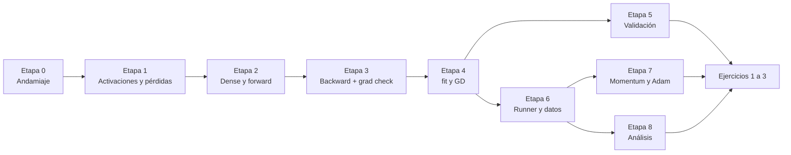

# Plan de implementación — Motor de redes neuronales (TP3 SIA)

Objetivo: llegar a un motor que resuelva XOR con `[2,2,1]` y pase el gradient check numérico, con la infraestructura de experimentos armada. Todo lo demás del TP se apoya en esto.

Meta de tiempo: **dos semanas** con el equipo de 4. Cada etapa tiene criterio de aceptación verificable; no se avanza sin cumplirlo.

---

## Principio de diseño

El perceptrón multicapa es el caso general; el perceptrón simple es una red de una sola capa. Escribimos backprop **una sola vez**.

| Modelo del enunciado | Cómo se expresa en el motor |
| --- | --- |
| Perceptrón simple escalón | `Network([n, 1], output_activation="step")`, regla de actualización del perceptrón |
| Perceptrón simple lineal | `Network([n, 1], output_activation="identity")`, loss MSE |
| Perceptrón simple no lineal | `Network([n, 1], output_activation="tanh"` o `"sigmoid")`, loss MSE |
| Perceptrón multicapa | `Network([n, h1, ..., m])`, backprop general |

El escalón es el único caso especial: no es derivable, así que su entrenamiento usa la regla clásica del perceptrón (`Δw = η (y − ŷ) x`) en vez de gradiente. Se implementa como un `Trainer` aparte, no ensuciando el backprop general.

---

## Etapa 0 — Andamiaje (día 1, todos juntos)

**Qué:** repo, estructura de carpetas vacía, `requirements.txt`, `pytest` corriendo con un test trivial, CI opcional, `CLAUDE.md` en la raíz.

**Aceptación:** los cuatro clonan, crean el venv y `pytest` pasa.

---

## Etapa 1 — Activaciones, pérdidas e inicializadores (días 2–3)

**Responsable:** A (motor). Revisa: D.

Interfaz:

```python
class Activation(Protocol):
    def forward(self, z: np.ndarray) -> np.ndarray: ...
    def backward(self, z: np.ndarray) -> np.ndarray:  # derivada evaluada en z
        ...


class Loss(Protocol):
    def value(self, y_true: np.ndarray, y_pred: np.ndarray) -> float: ...
    def grad(self, y_true: np.ndarray, y_pred: np.ndarray) -> np.ndarray:
        """dL/dy_pred, forma (n_muestras, n_salidas)."""
```

A implementar:

- Activaciones: `Step`, `Identity`, `Tanh`, `Sigmoid`, `ReLU`, `Softmax`.
- Pérdidas: `MSE`, `BinaryCrossEntropy`, `CategoricalCrossEntropy`.
- Inicializadores: `Uniform(a, b)`, `Xavier`, `He`.
- Registros por nombre: `ACTIVATIONS["tanh"]`, para que la config JSON resuelva strings.

Cuidados:

- `Softmax` + `CategoricalCrossEntropy` se implementan como par acoplado: el gradiente combinado es `ŷ − y`, mucho más estable que componer las dos derivadas por separado. Dejarlo comentado en el código.
- `Sigmoid` y `Softmax` necesitan protección contra overflow (restar el máximo antes del `exp`).
- Con `tanh`/`sigmoid`, guardar el factor de escala β si usan `tanh(βx)`.

**Aceptación:** `test_activations.py` compara cada derivada analítica contra la numérica `(f(z+ε) − f(z−ε)) / 2ε` con ε = 1e-5, tolerancia 1e-7, sobre un vector de valores que incluya negativos, cero y valores grandes.

---

## Etapa 2 — Capa densa y forward (día 4)

**Responsable:** A. Revisa: B.

```python
class Dense:
    def __init__(self, n_in, n_out, activation, initializer, rng): ...
    def forward(self, x):  # guarda x y z para el backward
        self.x = x
        self.z = x @ self.W + self.b
        return self.activation.forward(self.z)
```

- `W`: `(n_in, n_out)`. `b`: `(1, n_out)`, se suma por broadcasting.
- `Network.__init__(layer_sizes, hidden_activation, output_activation, initializer, rng)` construye la lista de capas.
- `Network.predict(X)` encadena forwards.

**Aceptación:** una red con pesos fijos conocidos produce, a mano, la salida esperada para una entrada de 2 elementos. Test con números escritos a mano.

---

## Etapa 3 — Backward y gradient check (días 5–7) ← la etapa crítica

**Responsable:** A, con B haciendo pair programming. **Nadie avanza a otra etapa hasta que esto esté verde.**

```python
class Dense:
    def backward(self, delta_out):
        """delta_out: dL/da de esta capa, forma (n, n_out).
        Devuelve dL/dx para la capa anterior y guarda grad_W, grad_b."""
        delta = delta_out * self.activation.backward(self.z)  # (n, n_out)
        self.grad_W = self.x.T @ delta  # (n_in, n_out)
        self.grad_b = delta.sum(axis=0, keepdims=True)  # (1, n_out)
        return delta @ self.W.T  # (n, n_in)
```

`Network.backward(y_true, y_pred)` arranca con `loss.grad(...)` y recorre las capas al revés.

**Gradient check numérico** (`tests/test_gradients.py`) — el test más importante del TP:

1. Red chica, por ejemplo `[3, 4, 2]`, pesos aleatorios con semilla fija, 5 muestras.
2. Forward + backward → gradiente analítico de cada parámetro.
3. Para cada parámetro `θ`: `(L(θ+ε) − L(θ−ε)) / 2ε` con ε = 1e-5.
4. Error relativo `|g_a − g_n| / max(|g_a|, |g_n|, 1e-8) < 1e-6`.
5. Repetir para cada combinación de activación oculta (`tanh`, `sigmoid`, `relu`) y pérdida (`MSE`, `CCE`).

Errores típicos que este test caza: signo invertido en el gradiente, faltar la transpuesta, no multiplicar por la derivada de la activación, sumar el bias sobre el eje equivocado, y aplicar la derivada de la activación evaluada en `a` en vez de en `z`.

**Aceptación:** gradient check en verde para todas las combinaciones.

---

## Etapa 4 — Entrenamiento y optimizador básico (día 8)

**Responsable:** A. Revisa: C.

```python
def fit(self, X, y, optimizer, loss, epochs, batch_size=None,
        validation=None, callbacks=(), rng=None) -> History
```

- `batch_size=None` → batch completo; `1` → estocástico; `k` → mini-batch. Barajar índices cada época con el `rng` de la red.
- `Optimizer` con interfaz `step(params, grads)` y estado interno propio. Primero solo `GD(lr)`.
- `History`: lista de dicts por época, exportable a `history.csv`.
- Callbacks: `PrintProgress(every=n)`, `EarlyStopping(patience, monitor)`. El motor nunca imprime por su cuenta.

**Aceptación:** con `y = x` y 50 muestras, el MSE baja monótonamente y termina por debajo de 1e-4.

---

## Etapa 5 — Ejercicio previo de validación (días 9–10)

**Responsable:** C y D, en paralelo con la etapa 6 de A y B.

Los cuatro casos como tests en `tests/test_validation.py`:

| Test | Setup | Aceptación |
| --- | --- | --- |
| AND | `x = {(−1,1),(1,−1),(−1,−1),(1,1)}`, `y = {−1,−1,−1,1}`, escalón | Error 0 en menos de 100 épocas |
| Lineal | 50 muestras de `y = x`, identidad, MSE | MSE final < 1e-4 |
| No lineal | 50 muestras de `y = tanh(x)`, tanh, MSE | MSE final < 1e-3 |
| XOR | `y = {1,1,−1,−1}`, `[2,2,1]` y `[2,3,2,1]` | Las 4 muestras bien clasificadas |

Además, no automatizable pero sí obligatorio: **una iteración completa de backprop de `[2,2,1]` hecha a mano**, con pesos iniciales fijos, comparada contra lo que imprime el código. El enunciado lo recomienda explícitamente. Dejarla escrita en `docs/verificacion_manual.md` — sirve para el informe y para la defensa oral.

Bonus barato y muy útil: graficar la frontera de decisión época a época en el caso AND. Es la mejor herramienta de debug del TP.

**Aceptación:** `pytest tests/test_validation.py` en verde y la verificación manual documentada.

---

## Etapa 6 — Infraestructura de experimentos (días 9–11)

**Responsable:** B. Revisa: D.

- `runner.py`: lee el JSON, resuelve defaults, valida claves desconocidas, arma dataset + modelo + optimizador, entrena, escribe `results/<run_name>_<timestamp>/`.
- `save`/`load` con `np.savez`: pesos, `layer_sizes`, nombres de activaciones, estado del optimizador. `load` tiene que permitir **seguir entrenando**, no solo predecir.
- `data/loaders.py`, `preprocess.py` (normalización de features, escalado y desescalado del target, one-hot) y `splits.py` (holdout, k-fold, estratificado).
- `metrics.py`: MSE, MAE, accuracy, precision, recall, F1, matriz de confusión.

**Aceptación:** una corrida de XOR lanzada desde un JSON produce el directorio de resultados completo; `load` + 10 épocas más continúa desde el loss donde quedó, no desde cero.

---

## Etapa 7 — Optimizadores avanzados (días 12–13)

**Responsable:** A.

- `Momentum(lr, alpha)`: `v ← α v − η g`, `θ ← θ + v`.
- `Adam(lr, beta1, beta2, eps)`: momentos de primer y segundo orden con corrección de sesgo.
- Ambos guardan su estado en `model.npz` para poder reanudar.

**Aceptación:** sobre XOR con la misma semilla, Adam converge en menos épocas que GD; el gradient check sigue en verde (los optimizadores no tocan el gradiente, solo el paso).

---

## Etapa 8 — Análisis (día 14)

**Responsable:** D.

`analysis/plots.py` con funciones que reciben uno o varios `run_id` y devuelven figuras: curvas de loss, comparación de barridos, matriz de confusión, frontera de decisión, curva precision/recall vs umbral. `analysis/tables.py` genera la tabla comparativa de corridas en markdown, lista para pegar en el informe.

Estilo de gráficos, uniforme desde el principio: ejes rotulados con unidades, leyenda con la configuración, misma paleta en todo el informe, tamaño y DPI fijos.

**Aceptación:** un comando regenera todas las figuras del informe desde `results/`.

---

## Resumen de dependencias



La etapa 3 es el cuello de botella real: mientras no esté verde, las etapas 5 en adelante producen resultados que no se pueden creer.

---

## Definición de "motor terminado"

- [ ] `pytest` completo en verde, incluido el gradient check en todas las combinaciones
- [ ] Los cuatro casos del ejercicio previo pasan como tests
- [ ] Verificación manual de `[2,2,1]` documentada en `docs/`
- [ ] Un experimento se lanza con `python -m experiments.runner <config.json>`
- [ ] `save` + `load` permiten reanudar un entrenamiento
- [ ] GD, Momentum y Adam disponibles y seleccionables por config
- [ ] Ningún loop por muestra en el camino de entrenamiento
- [ ] README con las instrucciones de la sección 3 de `CLAUDE.md`
